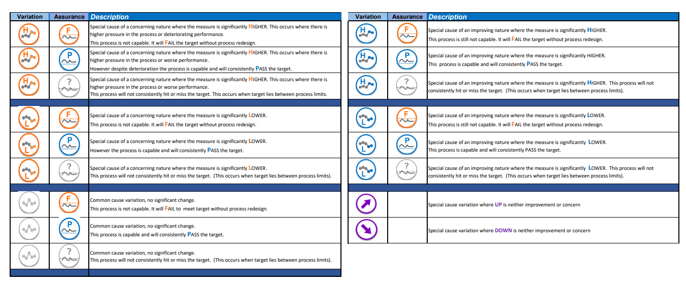

---
title: "MH rptt"
output: 
  html_document:
    toc: true
    toc_float: true
---    

```{r setup, include=FALSE}
knitr::opts_chunk$set(message=FALSE, warning=FALSE, echo = FALSE)

library(plyr)
library(readxl)
library(tidyverse)
library(gridExtra)
library(lubridate)
library(NHSRplotthedots)
library(janitor)
library(prophet)
library (flextable)
library(officer)
library(snakecase)
#library(gt)
library(reactable)
library(htmltools)
library(reactablefmtr)
library(anytime)
library(zoo)
library(ptw)
library(officer)


# read in data
dat <- read_excel("Copy of May22_CDPdata_QA.xlsx")


# clean names of columns
dat <- clean_names(dat)

# filter to just region and stps
dat <- dat %>% filter (region_name == 'SOUTH WEST', org_type %in% c('STP', 'Region')) 

# convert STP names to short names
dat <-
  dat %>% mutate (
    org_name = case_when(
      org_name == 'SOUTH WEST' ~ 'South West',
      org_name == 'DORSET STP' ~ 'Dorset',
      org_name == 'DEVON STP' ~ 'Devon',
      org_name == 'GLOUCESTERSHIRE STP' ~ 'Glouchestershire',
      org_name == 'BRISTOL, NORTH SOMERSET AND SOUTH GLOUCESTERSHIRE STP' ~ 'BNSSG',
      org_name == 'CORNWALL AND THE ISLES OF SCILLY HEALTH & SOCIAL CARE PARTNERSHIP (STP)' ~ 'Cornwall',
      org_name == 'BATH AND NORTH EAST SOMERSET, SWINDON AND WILTSHIRE STP' ~ 'BSW',
      org_name == 'SOMERSET STP' ~ 'Somerset',
      TRUE ~ 'Error - please check'
    )
  )

# rename a couple of columns
dat <-
  dat %>% rename ('measure' = 'data_source',
                  'STP' = 'org_name',
                  'rpt_mth' = 'reporting_period')

# remove these columns  ( - the ! means not, so select not these columns)
dat <-
  dat %>% select(!c(measure, region_code, org_code, region_name, stp_code, stp_name))

# convert the wide data to long  format
dat <-
  dat %>% pivot_longer(
    cols = out_of_area_placement_bed_days_inappropriate_only:smi_activity,
    names_to = 'measure',
    values_to = 'outturn',
    names_repair = 'unique'
  )

# convert the outturn to a numeric
dat$outturn <- as.numeric(dat$outturn)

# remove data with no outturn
dat <- dat %>% filter (outturn >= 0)

# add the latest data month column
max_mth <- dat %>% 
  group_by(measure, STP) %>% 
  mutate(lat_dat = max(rpt_mth)) %>% 
  ungroup()

#############################################################
# code to pad data with zero if there is null data in month #
#############################################################

# this takes the latest data per KPI (latest data is different for each KPI)
# where there are gaps in the time series this puts a blank for that month
max_mth <- max_mth %>% 
  group_by(measure, STP) %>%
  mutate(rpt_mth = as.Date(rpt_mth)) %>%
  complete(rpt_mth = seq.Date(min(rpt_mth), 
                              as.Date(max(max_mth$lat_dat)), 
                              by = "month")) %>%
  fill(c(org_type, 
         STP, 
         target, 
         measure, 
         lat_dat), 
       .direction = "up") %>%
  ungroup()

#test
max_mth <- max_mth %>% 
  filter (rpt_mth <= lat_dat)

dat <- max_mth

# replaces blanks with zeros
dat$outturn <- dat$outturn %>% replace_na(0)

# adds in a reporting date to end of month
dat$rpt_mth <- ceiling_date(dat$rpt_mth, 
                            "month") - days(1)

# add a column for each max date for each KPI
dat <- dat %>% 
  group_by(measure, 
           STP, 
           rpt_mth) %>% 
  summarise_each(list(max))

# creates an average by measure / STP
dat <- dat %>% 
  group_by(STP,
           measure) %>% 
  mutate (average = mean(outturn)) %>% 
  ungroup()

# read in meta data file
# this file contains addition information such as improvement direction
# and potentially flags for things such as trajectories or recalc limits
meta <- read_excel("KPI_meta_MH_v2.xlsx")

#################
# load in icons #
#################

# creates an object for each of the SPC icons
CCV      <- 'VariationIconCommonCause.jpg'
SCVHICON <- 'VariationIconConcernHigh.jpg'
SCVLOCON <- 'VariationIconConcernLow.jpg'
SCVHIIMP <- 'VariationIconImprovementHigh.jpg'
SCVLOIMP <- 'VariationIconImprovementLow.jpg'
PASSTARG <- 'AssuranceIconPass.jpg'
FAILTARG <- 'AssuranceIconFail.jpg'
RNDTARG  <- 'AssuranceIconHitOrMiss.jpg'
BLANK  <- 'blank.jpg'

up_good <- 'up_good.png'
down_good <- 'down_good.png'
up_bad <- 'up_bad.png'
down_bad <-  'down_bad.png'
side <- 'leftright.png'

UP_imp <- 'UP_imp.png'
DOWN_imp <- 'DOWN_imp.png'
SIDE_imp <- 'blank.jpg'


## Nelson rules for trend
nelsonr2 <- function(x, m = mean(x), minrun = 6) {
  # Nelson's QC rule 2: detect runs of >= 6 points on the same side of the mean
  n <- length(x)
  counts <- sign(x - m)
  result <- counts
  for (runlength in 2:6) {
    result <- result + c(counts[runlength:n], rep(0, runlength - 1))
    runs <- as.numeric(which(abs(result) >= 6))}
  
  runs <- if_else(length(runs)==0, 0, max(runs))
  nel2 <- if_else(runs==(n-5),
          if_else(x[n]>m,"up", "down")  , "no")
  # Nelson's QC rule 3: detect strict increase or decrease in >= 6 points in a row
  # Between 6 points you have 5 instances of increasing or decreasing. Therefore minrun - 1.
  # converts changes in time series into +1,0,-1 to show increase or decreasew

  x <- if (n <6){as.vector( padzeros(x, 6, side = "left"))} else {x}
  signs <- sign(c(x[-1], x[n]) - x)
  counts <- signs
  for (rl in 2:5) {
    counts <- counts + c(signs[rl:n], rep(0, rl - 1))
  }
  runs <- as.numeric(which(abs(counts) >= 5))
  runs <- padzeros(runs,1,side = "left")
  runs <- max(runs)
  nel3 <- if_else(runs==(n-7),
        if_else(x[n]>x[n-1],"up", "down")  , "no")
  if_else (nel2 == "no", nel3, nel2)
  
}


## Function to select the target achievement icon
Target_Ach_Icon <- function(TARGET, UCL, LCL, IMP) {
  ifelse(((TARGET > UCL) & (IMP == 'increase')), FAILTARG ,
         ifelse(((TARGET < LCL) & (IMP == 'decrease')), FAILTARG ,
                ifelse((between(TARGET, LCL, UCL)), RNDTARG ,
                       ifelse(((TARGET < LCL) &
                                 (IMP == 'Increase')), PASSTARG ,
                              ifelse(((TARGET > UCL) &
                                        (IMP == 'Decrease')
                              ), PASSTARG ,
                              RNDTARG))
                )))
}

## Function to select variation icon
Variation_Icon <- function(OUTTURN, UCL, LCL, IMP) {
  ifelse(((OUTTURN > UCL) & (IMP == 'increase')), SCVHIIMP,
         ifelse(((OUTTURN < LCL) &
                   (IMP == 'decrease')), SCVLOIMP,
                ifelse(((OUTTURN > UCL) &
                          (IMP == 'decrease')), SCVHICON,
                       ifelse(((OUTTURN < LCL) &
                                 (IMP == 'increase')), SCVLOCON, CCV)
                )))
}

#  initiates lists for charts to go into
spc_charts <- list()
spc_table <- list()
spc_icons <- list()
spc_trend <- list()
#spc_rate_charts <- list()
#spc_rates_table <- list()

# creates lists to loop
stp_lst <- unique(dat$STP)
measure_lst<- unique(dat$measure)

## creates charts for STP / measure
for  (j in measure_lst){
  for (i in stp_lst) {
    #i <- 'Glouchestershire'  # test STP
    #j <- 'cyp_1_actual'      # test metric
    #print(j)                 # print metric
    #print(i)                 # print metric (debug functions)
    
    # filter meta data to STP/measure
    meta_dat <- meta %>% 
      filter (measure == j,
              STP == i)
    
    # filter main data to STP/measure
    df <- dat %>%
      filter(measure == j,
             STP == i)
    
    # creates a dummy dataframe if there is no data for metric
    # it appears that sometimes data is missing within STPs for a metric
    # this creates a blank holder
    # (i seem to do this twice - need to check)
  
    end_date <- as.Date(max(dat$max_mth))
    dum <- df[nrow(df) + 1,]
    dum$rpt_mth <- end_date
    dum$org_type <- 0
    dum$STP <- i
    dum$target <- 0
    dum$measure <- j
    dum$outturn <- 0
    dum<- as.data.frame(dum)    

    # checks number of rows in data 
    # if blank will replace with the dummy dataframe
    df <- if (nrow(df) == 0) {(dum)} else {(df)}
    
    # feed data into nelson function
    trend <-  ifelse(length(df$outturn) <6, "NA",  nelsonr2(df$outturn))

    
    trend_dir <-
      case_when (
        trend == "up" & 
          meta_dat$improvement == "increase" ~ "up_good.png",
        trend == "up" &
          meta_dat$improvement == "decrease" ~ "up_bad.png",
        trend == "down" &
          meta_dat$improvement == "increase" ~ "down_bad.png",
        trend == "down" &
          meta_dat$improvement == "decrease" ~ "down_good.png",
        TRUE ~ "leftright.png"
      )
    
    spc_trend[[paste(i, j)]] <- trend_dir
    
    # take target as number from main data
    tar <- as.numeric(df[which(df$rpt_mth == max(df$rpt_mth)), 5])
    
    # create spc calcs and tables
    spc_cht <- df %>%
      filter(measure == j ,
             STP == i) %>%
      ptd_spc(
        value_field  = outturn,
        date_field = rpt_mth,
        target = tar,
        improvement_direction = meta_dat$improvement
      )
    
    # converts SPC data into dataframe
    table <- as.data.frame(tail(spc_cht, 1))
    
    # add tables into list
    spc_table[[paste(i, j)]] <- table
    
    # calc spc icons
    Icons <- c(Target_Ach_Icon (tar,
                                table$upl,
                                table$lpl,
                                meta_dat$improvement),
               Variation_Icon (table$y, 
                               table$upl, 
                               table$lpl, 
                               meta_dat$improvement),
               trend_dir)
    
    # put the icons into a list
    spc_icons[[paste(i, j)]] <- Icons
  }
}

plot_mc_plt <- function(measure, STP) {

    i <-   STP
    j <- measure
    
    # filter meta data to STP/measure
    meta_dat <- meta %>% 
      filter (measure == j,
              STP == i)
    
    # filter main data to STP/measure
    df <- dat %>%
      filter(measure == j,
             STP == i)
    
    # creates a dummy dataframe if there is no data for metric
    dum <- df[nrow(df) + 1,]
    dum$rpt_mth <- end_date
    dum$org_type <- 0
    dum$STP <- i
    dum$target <- 0
    dum$measure <- j
    dum$outturn <- 0
    dum<- as.data.frame(dum)    

    # if dataframe is blank replaces it with dummy
    df <- if (nrow(df) == 0) {(dum)} else {(df)}

    # take target as number from main data
    tar <- as.numeric(df[which(df$rpt_mth == max(df$rpt_mth)), 5])
    
    # create spc calcs and tables
    spc_cht <- df %>%
      filter(measure == j ,
             STP == i) %>%
      ptd_spc(
        value_field  = outturn,
        date_field = rpt_mth,
        target = tar,
        improvement_direction = meta_dat$improvement
      )
    
    # turn calcs into charts
    plot <- ptd_create_ggplot(
      spc_cht,
      icons_position = 'none',
      x_axis_date_format = "%b-%y",
      percentage_y_axis = meta_dat$data_percent,
      point_size = 2,
      x_axis_label = NULL,
      main_title	= NULL
    ) +
      theme(panel.grid.major = element_blank(),
            panel.grid.minor = element_blank())+
      geom_text(aes(y = table$mean
                    ,label = c("Mean",rep(NA,length(mean)-1)))
                ,vjust = -0.5
                ,hjust = 0
                ,size = 3
                ,colour = "grey"
                ,family = "Times") +
      geom_text(aes(y = table$upl
                    ,label = c("UPL",rep(NA,length(mean)-1)))
                ,vjust = 1
                ,hjust = 0
                ,size = 3
                ,colour = "grey"
                ,family = "Times") +
      geom_text(aes(y = table$lpl
                    ,label = c("LPL",rep(NA,length(mean)-1)))
                ,vjust = -0.5
                ,hjust = 0
                ,size = 3
                ,colour = "grey"
                ,family = "Times")
    
    # adds text to the target line if there is one
    if(!(is.null(tar))) {
      plot <- plot +
        geom_text(aes(y = tar
                      ,label = c("Target",rep(NA,length(mean)-1)))
                  ,vjust = - 0.2
                  ,hjust = 0
                  ,size = 4
                  ,colour = "red"
                  ,family = "Times")}
    
plot
}

######################  
# data summary table #
######################

# need to do a little more data wrangling at this stage as want to convert outturns
# and percentages into character strings, this allows being able to add percentage signs
# and when denominators / numerators are available - will be able to add into one string

# need to create a data summary 
# this is based on the latest data for each KPI
dat_sum <- dat %>% filter(rpt_mth == lat_dat)

# this joins the data from the meta data excell sheet
dat_sum <- dat_sum %>% left_join (meta, by = c("STP", "measure") )

bar_data <- dat_sum

# converts outturn, target and average into a percentage or a number string
# warning - this converts the field to a string rather than double format
# in effect this split the datatable into two and applies one format to
# the percentages and then joins them back together again
dat_sum_perc <- dat_sum %>% 
  filter(data_percent=="TRUE") %>% 
  mutate (outturn = formattable::percent(outturn,1), 
          target = formattable::percent(target,1), 
          average = formattable::percent(average,1))
dat_sum_perc$outturn <- as.character(dat_sum_perc$outturn)
dat_sum_perc$target <- as.character(dat_sum_perc$target)
dat_sum_perc$average <- as.character(dat_sum_perc$average)

dat_sum_num <- dat_sum %>% 
  filter(data_percent=="FALSE") 
dat_sum_num$outturn <- as.character(round(dat_sum_num$outturn),1)
dat_sum_num$target <- as.numeric(dat_sum_num$target)
dat_sum_num$target <- as.character(round(dat_sum_num$target),1)
dat_sum_num$average <- as.character(round(dat_sum_num$average),1)

#  bind them back together again
dat_sum <- rbind(dat_sum_perc, dat_sum_num)

# converts the list of SPC / trend icons into a data frame
unlist_icons<-bind_rows(spc_icons)
unlist_trend<- bind_rows(spc_trend)

# transposes the dataframe (swaps rows and columns)
unlist_icons <- as.data.frame(t(unlist_icons))

# converts the index into a row of data in the dataframe
unlist_icons <- cbind(measure = rownames(unlist_icons), 
                      unlist_icons)

# removes the named index 
rownames(unlist_icons) <- NULL

# select required - this also determines the order of the summary table
dat_sum <- dat_sum %>% 
  select ('rpt_mth',
          'measure', 
          'STP', 
          'target', 
          'outturn', 
          'improvement', 
          'average', 
          'spc') 

# create column of concatinated names to join icons to
dat_sum$concat <- paste(dat_sum$STP,dat_sum$measure)

# join icons to data sum
dat_sum_join <- dat_sum %>% left_join(unlist_icons, by = c("concat"= "measure" ))

# remove concat column
dat_sum_join <- dat_sum_join %>%  select (!"concat")

# convert case of text
dat_sum_join$measure <- to_sentence_case(dat_sum_join$measure)

# converts report date to human date
dat_sum_join$rpt_mth <- format(dat_sum_join$rpt_mth, "%b-%Y")

# replaces nulls with a blank
dat_sum_join$V1 <- dat_sum_join$V1 %>% 
  replace_na(BLANK)
dat_sum_join$V2 <- dat_sum_join$V2 %>% 
  replace_na(BLANK)

# remove icons where spc is not relevant - as marked in meta file
dat_sum_join$V1 <- if_else(dat_sum_join$spc =="N", BLANK, dat_sum_join$V1) 
dat_sum_join$V2 <- if_else(dat_sum_join$spc =="N", BLANK, dat_sum_join$V2) 

sum_three <- dat_sum_join


sum_two <- dat_sum_join


####################################
# create bar charts of performance #
####################################

# this makes a bar graph for each measure
# this allows you to highlight regional results and show how STPs compare
# some metrics work on a total amount for region rather than proportion and so
# need to have a think about how this is shown - (to do!)

kpi_bar_list <- list()
kpi_list <- unique(bar_data$measure) 
bar_data$outturn <- as.numeric(bar_data$outturn)
bar_data$target <- as.numeric(bar_data$target)

# loop through each KPI
for (i in kpi_list) {
  #i = "cyp_eating_disorder_waiting_time_urgent" # test version
  summary <- bar_data %>% filter (measure == i) 
  
  bar <- summary %>% 
    ggplot(aes(reorder(STP,
                       outturn*100), 
               outturn*100, 
               fill=factor(if_else(STP=="South West",
                                   "Highlighted",
                                   "Normal")))) + 
    scale_fill_manual(name = "area", 
                      values=c("#ED8B00",
                               '#41B6E6')) +
    geom_bar(stat="identity", 
             show.legend = FALSE) +
    # this added a target line - however some KPIs had a target per STP
    # and so did not work properly
    geom_point(aes(reorder(STP,
                       outturn*100), 
               target*100), 
               color = "red", 
               size=10, 
               shape=18,
               show.legend = FALSE) +
    coord_flip() + 
    theme_minimal() + 
    theme(axis.title.x=element_blank(),
          axis.text.x=element_blank(),
          axis.ticks.x=element_blank(),
          axis.title.y=element_blank())
  
  kpi_bar_list[[i]] <- bar
}

###################################
# alternative regional / ccg view #
###################################

# takes the data summary table
sum_three <- dat_sum_join

# adds text for 'no target'
sum_three$target <- sum_three$target %>% replace_na("No target")
sum_three$target <-  if_else(sum_three$target  == 'NA', "No target", sum_three$target)

# selects required columns
sum_three <- sum_three %>% 
  select (STP, rpt_mth,measure,improvement, outturn, target,  V1, V2, V3, average)

# renames columns
sum_three <- sum_three %>% rename(
  "Report date" = rpt_mth,
  "Indicator" = measure,
  "Indicator value" = outturn,
  "Assurance" = V1,
  "Variation" = V2,
  "Target" = target,
  "Trend" = V3,
  "Improvement direction" = improvement,
  "Average performance" = average
)

# converts trend detail into icons 
# could probably hard code this in earlier section
sum_three <- sum_three %>% 
  mutate(`Improvement direction` = (case_when(`Improvement direction`== "increase" ~  UP_imp,
                                  `Improvement direction` == "decrease" ~ DOWN_imp,
                                  `Improvement direction` == "neutral" ~ SIDE_imp,
                                  TRUE ~ SIDE_imp)))

# reorder rows
# sum_three$Indicator <- factor(sum_three$Indicator, 
#                               levels=c('Iapt access monthly', 
#                                        'Iapt access rate', 
#                                        'Iapt access activity rolling quarter', 
#                                        'Iapt access 65', 
#                                        'Iapt 6 wk wait patient level',
#                                        'Iapt 18 wk wait patient level',
#                                        'Iapt 90 d',
#                                        'Iapt recovery monthly',
#                                        'Iapt recovery bame',
#                                        'Iapt recovery white british',
#                                        'Eip waiting times mhsds',
#                                        'Eip l 2 above',
#                                        'Eip l 3 above',
#                                        'Ips',
#                                        'Smi activity',
#                                        'Smi percent achievement',
#                                        'Dementia diagnosis rate',
#                                        'Out of area placement bed days inappropriate only',
#                                        'Out of area placement percent external inappropriate only',
#                                        'Adult acute over 60 days rate',
#                                        'Older adult acute over 90 days rate',
#                                        'In patient no contact',
#                                        'In patient white british no contact',
#                                        'In patient non white british no contact',
#                                        'X 12 hr breaches cyp activity',
#                                        'X 12 hr breaches adults rate',
#                                        'X 72 hr follow up',
#                                        'Data quality consistency',
#                                        'Data quality coverage',
#                                        'Data quality outcomes',
#                                        'Dqmi',
#                                        'Snomed ct'))

####################################
# function to create summary table #
####################################


tab_fun <- function(title, KPIs, STP_filter, sum_three) {
  sum_three_stp <-
    sum_three %>% 
    filter(STP == STP_filter)
  sum_three_stp <- sum_three_stp %>% 
    filter(Indicator %in% KPIs)
  
  # change these to change icon sizes
  size <- 0.2
  size_imp <- 0.6
  
  ft_sum <- flextable(sum_three_stp)
  
  # converts table output to image for icons - improvment direction
  ft_sum <-
    compose(ft_sum,
            j = 4,
            value = as_paragraph(
              as_image(
                src = sum_three_stp$`Improvement direction`,
                width = size,
                height = size
              )
            ),
            part = "body")
  
  # converts table output to image for icons - SPC assurance
  ft_sum <-
    compose(ft_sum,
            j = 7,
            value = as_paragraph(
              as_image(
                src = sum_three_stp$`Assurance`,
                width = size_imp,
                height = size_imp
              )
            ),
            part = "body")
  
  # converts table output to image for icons - spc variation
  ft_sum <-
    compose(ft_sum,
            j = 8,
            value = as_paragraph(
              as_image(
                src = sum_three_stp$`Variation`,
                width = size_imp,
                height = size_imp
              )
            ),
            part = "body")
  
  # converts table output to image for icons - trend
  ft_sum <-
    compose(ft_sum,
            j = 9,
            value = as_paragraph(
              as_image(
                src = sum_three_stp$`Trend`,
                width = size_imp * 0.9,
                height = size_imp * 0.9
              )
            ),
            part = "body")
  ft_sum <- add_header_row(ft_sum, values = title, colwidths = 10)
  ft_sum <- bg(ft_sum,
               j = 1,
               bg = "#41B6E6",
               part = "header")
  ft_sum <- width(ft_sum, j = 3,  width = 15)
  ft_sum <- width(ft_sum, j = 6,  width = 5)
  ft_sum
}

#######################################################
# below chucks it all together into a markdown report #
#######################################################

# need to add commentary around KPI construction
# need to add automated commentary  around assurance, achievement and trend
# poss convert to xarigan slide version 
# need to update key
# need to tidy names of KPIs throughout entire report
# need to adjust STPs so that any set can be selected
# need to pull in finance data


```

```{=html}
#<style type="text/css">
#.main-container {
#  max-width: 1800px;
#  margin-left: auto;
#  margin-right: auto;
#}
#</style>
```

# Mental Health Report

## Summary table  {.tabset .tabset-fade .tabset-pills}

### South West

South West Regional Position

```{r}
filter <- "South West"

tab_fun (
  "Children and Young People (CYP) Mental Health",
  c(
    "Cyp eating disorder waiting time routine",
    "Cyp eating disorder waiting time urgent",
    "Cyp 1 actual",   # need to return latest figures not final month figures
    "Cyp 2 actual",
    "Cyp access rate",
    "X 12 hr breaches cyp activity",
    "X 12 hr breaches cyp rate"
  ),
   STP_filter = filter,
   sum_three = sum_three)

tab_fun (
  "Perinatal Mental Health",
  c(
    "Perinatal access",
    "Perinatal access ytd"
  ),
   STP_filter = filter,
   sum_three = sum_three)
tab_fun (
  "Adult mental health: common mental health problems (Improving Access to Psychological Therapies  services - IAPT)",
  c(
    "Iapt access monthly",
    "Iapt access rate",
    "Iapt access activity rolling quarter",
    "Iapt access 65",
    "Iapt 6 wk wait patient level",
    "Iapt 18 wk wait patient level",
    "Iapt 90 d",
    "Iapt recovery monthly",
    "Iapt recovery bame",
    "Iapt recovery white british"
  ),
   STP_filter = filter,
   sum_three = sum_three)
tab_fun (
  "Early intervention in psychosis (EIP)",
  c(
    "Eip waiting times mhsds",
    "Eip l 2 above",
    "Eip l 3 above"),
   STP_filter = filter,
   sum_three = sum_three)
tab_fun (
  "Employment support",
  c(
    "Ips"),
   STP_filter = filter,
   sum_three)
tab_fun (
  "Physical Health Checks (SMI)",
  c("Smi activity",
    "Smi percent achievement"),
     STP_filter = filter,
   sum_three = sum_three)
tab_fun (
  "Physical Health Checks (SMI) and Dementia diagnosis",
  c("Smi activity",
    "Smi percent achievement",
    "Dementia diagnosis rate"),
   STP_filter = filter,
   sum_three = sum_three)
tab_fun (
  "Acute care and Suicide prevention",
  c("Out of area placement bed days inappropriate only",
    "Out of area placement percent external inappropriate only",
    "Adult acute over 60 days rate",
    "Older adult acute over 90 days rate",
    "In patient no contact",
    "In patient white british no contact",
    "In patient non white british no contact",
    "X 12 hr breaches cyp activity",
    "X 12 hr breaches adults rate",
    "X 72 hr follow up"),
   STP_filter = filter,
   sum_three = sum_three)
tab_fun (
  "Data Quality",
  c("Data quality consistency",
    "Data quality coverage",
    "Data quality outcomes",
    "Dqmi",
    "Snomed ct"),
   STP_filter = filter,
   sum_three = sum_three)

```

### BNSSG

Bristol, North Somerset and South Gloucestershire

```{r}

filter <- "BNSSG"

tab_fun (
  "Children and Young People (CYP) Mental Health",
  c(
    "Cyp eating disorder waiting time routine",
    "Cyp eating disorder waiting time urgent",
    "Cyp 1 actual",   # need to return latest figures not final month figures
    "Cyp 2 actual",
    "Cyp access rate",
    "X 12 hr breaches cyp activity",
    "X 12 hr breaches cyp rate"
  ),
   STP_filter = filter,
   sum_three = sum_three)

tab_fun (
  "Perinatal Mental Health",
  c(
    "Perinatal access",
    "Perinatal access ytd"
  ),
   STP_filter = filter,
   sum_three = sum_three)
tab_fun (
  "Adult mental health: common mental health problems (Improving Access to Psychological Therapies  services - IAPT)",
  c(
    "Iapt access monthly",
    "Iapt access rate",
    "Iapt access activity rolling quarter",
    "Iapt access 65",
    "Iapt 6 wk wait patient level",
    "Iapt 18 wk wait patient level",
    "Iapt 90 d",
    "Iapt recovery monthly",
    "Iapt recovery bame",
    "Iapt recovery white british"
  ),
   STP_filter = filter,
   sum_three = sum_three)
tab_fun (
  "Early intervention in psychosis (EIP)",
  c(
    "Eip waiting times mhsds",
    "Eip l 2 above",
    "Eip l 3 above"),
   STP_filter = filter,
   sum_three = sum_three)
tab_fun (
  "Employment support",
  c(
    "Ips"),
   STP_filter = filter,
   sum_three)
tab_fun (
  "Physical Health Checks (SMI)",
  c("Smi activity",
    "Smi percent achievement"),
     STP_filter = filter,
   sum_three = sum_three)
tab_fun (
  "Physical Health Checks (SMI) and Dementia diagnosis",
  c("Smi activity",
    "Smi percent achievement",
    "Dementia diagnosis rate"),
   STP_filter = filter,
   sum_three = sum_three)
tab_fun (
  "Acute care and Suicide prevention",
  c("Out of area placement bed days inappropriate only",
    "Out of area placement percent external inappropriate only",
    "Adult acute over 60 days rate",
    "Older adult acute over 90 days rate",
    "In patient no contact",
    "In patient white british no contact",
    "In patient non white british no contact",
    "X 12 hr breaches cyp activity",
    "X 12 hr breaches adults rate",
    "X 72 hr follow up"),
   STP_filter = filter,
   sum_three = sum_three)
tab_fun (
  "Data Quality",
  c("Data quality consistency",
    "Data quality coverage",
    "Data quality outcomes",
    "Dqmi",
    "Snomed ct"),
   STP_filter = filter,
   sum_three = sum_three)

```
### BSW

Bath and North East Somerset, Swindon and Wiltshire

```{r}

filter <- "BSW"

tab_fun (
  "Children and Young People (CYP) Mental Health",
  c(
    "Cyp eating disorder waiting time routine",
    "Cyp eating disorder waiting time urgent",
    "Cyp 1 actual",   # need to return latest figures not final month figures
    "Cyp 2 actual",
    "Cyp access rate",
    "X 12 hr breaches cyp activity",
    "X 12 hr breaches cyp rate"
  ),
   STP_filter = filter,
   sum_three = sum_three)

tab_fun (
  "Perinatal Mental Health",
  c(
    "Perinatal access",
    "Perinatal access ytd"
  ),
   STP_filter = filter,
   sum_three = sum_three)
tab_fun (
  "Adult mental health: common mental health problems (Improving Access to Psychological Therapies  services - IAPT)",
  c(
    "Iapt access monthly",
    "Iapt access rate",
    "Iapt access activity rolling quarter",
    "Iapt access 65",
    "Iapt 6 wk wait patient level",
    "Iapt 18 wk wait patient level",
    "Iapt 90 d",
    "Iapt recovery monthly",
    "Iapt recovery bame",
    "Iapt recovery white british"
  ),
   STP_filter = filter,
   sum_three = sum_three)
tab_fun (
  "Early intervention in psychosis (EIP)",
  c(
    "Eip waiting times mhsds",
    "Eip l 2 above",
    "Eip l 3 above"),
   STP_filter = filter,
   sum_three = sum_three)
tab_fun (
  "Employment support",
  c(
    "Ips"),
   STP_filter = filter,
   sum_three)
tab_fun (
  "Physical Health Checks (SMI)",
  c("Smi activity",
    "Smi percent achievement"),
     STP_filter = filter,
   sum_three = sum_three)
tab_fun (
  "Physical Health Checks (SMI) and Dementia diagnosis",
  c("Smi activity",
    "Smi percent achievement",
    "Dementia diagnosis rate"),
   STP_filter = filter,
   sum_three = sum_three)
tab_fun (
  "Acute care and Suicide prevention",
  c("Out of area placement bed days inappropriate only",
    "Out of area placement percent external inappropriate only",
    "Adult acute over 60 days rate",
    "Older adult acute over 90 days rate",
    "In patient no contact",
    "In patient white british no contact",
    "In patient non white british no contact",
    "X 12 hr breaches cyp activity",
    "X 12 hr breaches adults rate",
    "X 72 hr follow up"),
   STP_filter = filter,
   sum_three = sum_three)
tab_fun (
  "Data Quality",
  c("Data quality consistency",
    "Data quality coverage",
    "Data quality outcomes",
    "Dqmi",
    "Snomed ct"),
   STP_filter = filter,
   sum_three = sum_three)

```
### Cornwall

Cornwall and the Isles of Scilly Health and Social Care Partnership

```{r}

filter <- "Cornwall"

tab_fun (
  "Children and Young People (CYP) Mental Health",
  c(
    "Cyp eating disorder waiting time routine",
    "Cyp eating disorder waiting time urgent",
    "Cyp 1 actual",   # need to return latest figures not final month figures
    "Cyp 2 actual",
    "Cyp access rate",
    "X 12 hr breaches cyp activity",
    "X 12 hr breaches cyp rate"
  ),
   STP_filter = filter,
   sum_three = sum_three)

tab_fun (
  "Perinatal Mental Health",
  c(
    "Perinatal access",
    "Perinatal access ytd"
  ),
   STP_filter = filter,
   sum_three = sum_three)
tab_fun (
  "Adult mental health: common mental health problems (Improving Access to Psychological Therapies  services - IAPT)",
  c(
    "Iapt access monthly",
    "Iapt access rate",
    "Iapt access activity rolling quarter",
    "Iapt access 65",
    "Iapt 6 wk wait patient level",
    "Iapt 18 wk wait patient level",
    "Iapt 90 d",
    "Iapt recovery monthly",
    "Iapt recovery bame",
    "Iapt recovery white british"
  ),
   STP_filter = filter,
   sum_three = sum_three)
tab_fun (
  "Early intervention in psychosis (EIP)",
  c(
    "Eip waiting times mhsds",
    "Eip l 2 above",
    "Eip l 3 above"),
   STP_filter = filter,
   sum_three = sum_three)
tab_fun (
  "Employment support",
  c(
    "Ips"),
   STP_filter = filter,
   sum_three)
tab_fun (
  "Physical Health Checks (SMI)",
  c("Smi activity",
    "Smi percent achievement"),
     STP_filter = filter,
   sum_three = sum_three)
tab_fun (
  "Physical Health Checks (SMI) and Dementia diagnosis",
  c("Smi activity",
    "Smi percent achievement",
    "Dementia diagnosis rate"),
   STP_filter = filter,
   sum_three = sum_three)
tab_fun (
  "Acute care and Suicide prevention",
  c("Out of area placement bed days inappropriate only",
    "Out of area placement percent external inappropriate only",
    "Adult acute over 60 days rate",
    "Older adult acute over 90 days rate",
    "In patient no contact",
    "In patient white british no contact",
    "In patient non white british no contact",
    "X 12 hr breaches cyp activity",
    "X 12 hr breaches adults rate",
    "X 72 hr follow up"),
   STP_filter = filter,
   sum_three = sum_three)
tab_fun (
  "Data Quality",
  c("Data quality consistency",
    "Data quality coverage",
    "Data quality outcomes",
    "Dqmi",
    "Snomed ct"),
   STP_filter = filter,
   sum_three = sum_three)

```

### Devon

Devon

```{r}

filter <- "Devon"

tab_fun (
  "Children and Young People (CYP) Mental Health",
  c(
    "Cyp eating disorder waiting time routine",
    "Cyp eating disorder waiting time urgent",
    "Cyp 1 actual",   # need to return latest figures not final month figures
    "Cyp 2 actual",
    "Cyp access rate",
    "X 12 hr breaches cyp activity",
    "X 12 hr breaches cyp rate"
  ),
   STP_filter = filter,
   sum_three = sum_three)

tab_fun (
  "Perinatal Mental Health",
  c(
    "Perinatal access",
    "Perinatal access ytd"
  ),
   STP_filter = filter,
   sum_three = sum_three)
tab_fun (
  "Adult mental health: common mental health problems (Improving Access to Psychological Therapies  services - IAPT)",
  c(
    "Iapt access monthly",
    "Iapt access rate",
    "Iapt access activity rolling quarter",
    "Iapt access 65",
    "Iapt 6 wk wait patient level",
    "Iapt 18 wk wait patient level",
    "Iapt 90 d",
    "Iapt recovery monthly",
    "Iapt recovery bame",
    "Iapt recovery white british"
  ),
   STP_filter = filter,
   sum_three = sum_three)
tab_fun (
  "Early intervention in psychosis (EIP)",
  c(
    "Eip waiting times mhsds",
    "Eip l 2 above",
    "Eip l 3 above"),
   STP_filter = filter,
   sum_three = sum_three)
tab_fun (
  "Employment support",
  c(
    "Ips"),
   STP_filter = filter,
   sum_three)
tab_fun (
  "Physical Health Checks (SMI)",
  c("Smi activity",
    "Smi percent achievement"),
     STP_filter = filter,
   sum_three = sum_three)
tab_fun (
  "Physical Health Checks (SMI) and Dementia diagnosis",
  c("Smi activity",
    "Smi percent achievement",
    "Dementia diagnosis rate"),
   STP_filter = filter,
   sum_three = sum_three)
tab_fun (
  "Acute care and Suicide prevention",
  c("Out of area placement bed days inappropriate only",
    "Out of area placement percent external inappropriate only",
    "Adult acute over 60 days rate",
    "Older adult acute over 90 days rate",
    "In patient no contact",
    "In patient white british no contact",
    "In patient non white british no contact",
    "X 12 hr breaches cyp activity",
    "X 12 hr breaches adults rate",
    "X 72 hr follow up"),
   STP_filter = filter,
   sum_three = sum_three)
tab_fun (
  "Data Quality",
  c("Data quality consistency",
    "Data quality coverage",
    "Data quality outcomes",
    "Dqmi",
    "Snomed ct"),
   STP_filter = filter,
   sum_three = sum_three)

```

### Dorset

Dorset 

```{r}

filter <- "Dorset"

tab_fun (
  "Children and Young People (CYP) Mental Health",
  c(
    "Cyp eating disorder waiting time routine",
    "Cyp eating disorder waiting time urgent",
    "Cyp 1 actual",   # need to return latest figures not final month figures
    "Cyp 2 actual",
    "Cyp access rate",
    "X 12 hr breaches cyp activity",
    "X 12 hr breaches cyp rate"
  ),
   STP_filter = filter,
   sum_three = sum_three)

tab_fun (
  "Perinatal Mental Health",
  c(
    "Perinatal access",
    "Perinatal access ytd"
  ),
   STP_filter = filter,
   sum_three = sum_three)
tab_fun (
  "Adult mental health: common mental health problems (Improving Access to Psychological Therapies  services - IAPT)",
  c(
    "Iapt access monthly",
    "Iapt access rate",
    "Iapt access activity rolling quarter",
    "Iapt access 65",
    "Iapt 6 wk wait patient level",
    "Iapt 18 wk wait patient level",
    "Iapt 90 d",
    "Iapt recovery monthly",
    "Iapt recovery bame",
    "Iapt recovery white british"
  ),
   STP_filter = filter,
   sum_three = sum_three)
tab_fun (
  "Early intervention in psychosis (EIP)",
  c(
    "Eip waiting times mhsds",
    "Eip l 2 above",
    "Eip l 3 above"),
   STP_filter = filter,
   sum_three = sum_three)
tab_fun (
  "Employment support",
  c(
    "Ips"),
   STP_filter = filter,
   sum_three)
tab_fun (
  "Physical Health Checks (SMI)",
  c("Smi activity",
    "Smi percent achievement"),
     STP_filter = filter,
   sum_three = sum_three)
tab_fun (
  "Physical Health Checks (SMI) and Dementia diagnosis",
  c("Smi activity",
    "Smi percent achievement",
    "Dementia diagnosis rate"),
   STP_filter = filter,
   sum_three = sum_three)
tab_fun (
  "Acute care and Suicide prevention",
  c("Out of area placement bed days inappropriate only",
    "Out of area placement percent external inappropriate only",
    "Adult acute over 60 days rate",
    "Older adult acute over 90 days rate",
    "In patient no contact",
    "In patient white british no contact",
    "In patient non white british no contact",
    "X 12 hr breaches cyp activity",
    "X 12 hr breaches adults rate",
    "X 72 hr follow up"),
   STP_filter = filter,
   sum_three = sum_three)
tab_fun (
  "Data Quality",
  c("Data quality consistency",
    "Data quality coverage",
    "Data quality outcomes",
    "Dqmi",
    "Snomed ct"),
   STP_filter = filter,
   sum_three = sum_three)

```

### Glouchestershire

Gloucestershire 

```{r}

filter <- "Glouchestershire"

tab_fun (
  "Children and Young People (CYP) Mental Health",
  c(
    "Cyp eating disorder waiting time routine",
    "Cyp eating disorder waiting time urgent",
    "Cyp 1 actual",   # need to return latest figures not final month figures
    "Cyp 2 actual",
    "Cyp access rate",
    "X 12 hr breaches cyp activity",
    "X 12 hr breaches cyp rate"
  ),
   STP_filter = filter,
   sum_three = sum_three)

tab_fun (
  "Perinatal Mental Health",
  c(
    "Perinatal access",
    "Perinatal access ytd"
  ),
   STP_filter = filter,
   sum_three = sum_three)
tab_fun (
  "Adult mental health: common mental health problems (Improving Access to Psychological Therapies  services - IAPT)",
  c(
    "Iapt access monthly",
    "Iapt access rate",
    "Iapt access activity rolling quarter",
    "Iapt access 65",
    "Iapt 6 wk wait patient level",
    "Iapt 18 wk wait patient level",
    "Iapt 90 d",
    "Iapt recovery monthly",
    "Iapt recovery bame",
    "Iapt recovery white british"
  ),
   STP_filter = filter,
   sum_three = sum_three)
tab_fun (
  "Early intervention in psychosis (EIP)",
  c(
    "Eip waiting times mhsds",
    "Eip l 2 above",
    "Eip l 3 above"),
   STP_filter = filter,
   sum_three = sum_three)
tab_fun (
  "Employment support",
  c(
    "Ips"),
   STP_filter = filter,
   sum_three)
tab_fun (
  "Physical Health Checks (SMI)",
  c("Smi activity",
    "Smi percent achievement"),
     STP_filter = filter,
   sum_three = sum_three)
tab_fun (
  "Physical Health Checks (SMI) and Dementia diagnosis",
  c("Smi activity",
    "Smi percent achievement",
    "Dementia diagnosis rate"),
   STP_filter = filter,
   sum_three = sum_three)
tab_fun (
  "Acute care and Suicide prevention",
  c("Out of area placement bed days inappropriate only",
    "Out of area placement percent external inappropriate only",
    "Adult acute over 60 days rate",
    "Older adult acute over 90 days rate",
    "In patient no contact",
    "In patient white british no contact",
    "In patient non white british no contact",
    "X 12 hr breaches cyp activity",
    "X 12 hr breaches adults rate",
    "X 72 hr follow up"),
   STP_filter = filter,
   sum_three = sum_three)
tab_fun (
  "Data Quality",
  c("Data quality consistency",
    "Data quality coverage",
    "Data quality outcomes",
    "Dqmi",
    "Snomed ct"),
   STP_filter = filter,
   sum_three = sum_three)

```

### Somerset 

Somerset

```{r}

filter <- "Somerset"

tab_fun (
  "Children and Young People (CYP) Mental Health",
  c(
    "Cyp eating disorder waiting time routine",
    "Cyp eating disorder waiting time urgent",
    "Cyp 1 actual",   # need to return latest figures not final month figures
    "Cyp 2 actual",
    "Cyp access rate",
    "X 12 hr breaches cyp activity",
    "X 12 hr breaches cyp rate"
  ),
   STP_filter = filter,
   sum_three = sum_three)

tab_fun (
  "Perinatal Mental Health",
  c(
    "Perinatal access",
    "Perinatal access ytd"
  ),
   STP_filter = filter,
   sum_three = sum_three)
tab_fun (
  "Adult mental health: common mental health problems (Improving Access to Psychological Therapies  services - IAPT)",
  c(
    "Iapt access monthly",
    "Iapt access rate",
    "Iapt access activity rolling quarter",
    "Iapt access 65",
    "Iapt 6 wk wait patient level",
    "Iapt 18 wk wait patient level",
    "Iapt 90 d",
    "Iapt recovery monthly",
    "Iapt recovery bame",
    "Iapt recovery white british"
  ),
   STP_filter = filter,
   sum_three = sum_three)
tab_fun (
  "Early intervention in psychosis (EIP)",
  c(
    "Eip waiting times mhsds",
    "Eip l 2 above",
    "Eip l 3 above"),
   STP_filter = filter,
   sum_three = sum_three)
tab_fun (
  "Employment support",
  c(
    "Ips"),
   STP_filter = filter,
   sum_three)
tab_fun (
  "Physical Health Checks (SMI) and Dementia diagnosis",
  c("Smi activity",
    "Smi percent achievement",
    "Dementia diagnosis rate"),
   STP_filter = filter,
   sum_three = sum_three)
tab_fun (
  "Acute care and Suicide prevention",
  c("Out of area placement bed days inappropriate only",
    "Out of area placement percent external inappropriate only",
    "Adult acute over 60 days rate",
    "Older adult acute over 90 days rate",
    "In patient no contact",
    "In patient white british no contact",
    "In patient non white british no contact",
    "X 12 hr breaches cyp activity",
    "X 12 hr breaches adults rate",
    "X 72 hr follow up"),
   STP_filter = filter,
   sum_three = sum_three)
tab_fun (
  "Data Quality",
  c("Data quality consistency",
    "Data quality coverage",
    "Data quality outcomes",
    "Dqmi",
    "Snomed ct"),
   STP_filter = filter,
   sum_three = sum_three)

```

## {.unlisted .unnumbered}

# Adult mental health: common mental health problems (Improving Access to Psychological Therapies  services - IAPT)

## IAPT 6 Week Waits

#### Regional comparison and overall south west position
```{r, figures-side, fig.show="hold", out.width="50%", dpi= 500, fig.height=5}
kpi_bar_list[17]
plot_mc_plt("iapt_6wk_wait_patient_level", "South West")
```

## Regional detail {.tabset .tabset-fade .tabset-pills}

### BSW

Bath and North East Somerset, Swindon and Wiltshire

```{r, out.width = "100%", fig.height=3}
plot_mc_plt("iapt_6wk_wait_patient_level", "BSW")
```

### BNSSG 

Bristol, North Somerset and South Gloucestershire

```{r, out.width = "100%", fig.height=3}
plot_mc_plt("iapt_6wk_wait_patient_level", "BNSSG")
```

### Cornwall 

Cornwall

```{r, out.width = "100%", fig.height=3}
plot_mc_plt("iapt_6wk_wait_patient_level", "Cornwall")

```

### Devon 

Devon

```{r, out.width = "100%", fig.height=3}
plot_mc_plt("iapt_6wk_wait_patient_level", "Devon")

```

### Dorset 

Dorset

```{r, out.width = "100%", fig.height=3}
plot_mc_plt("iapt_6wk_wait_patient_level", "Dorset")

```

### Glouchestershire 

Glouchestershire

```{r, out.width = "100%", fig.height=3}
plot_mc_plt("iapt_6wk_wait_patient_level", "Glouchestershire")

```

### Somerset 

Somerset

```{r, out.width = "100%", fig.height=3}
plot_mc_plt("iapt_6wk_wait_patient_level", "Somerset")

```

## {.unlisted .unnumbered}

## IAPT 18 Week Waits

#### Regional comparison and overall south west position
```{r, fig.show="hold", out.width="50%", dpi= 500, fig.height=5}
kpi_bar_list[17]
plot_mc_plt("iapt_18wk_wait_patient_level", "South West")
```

## Regional detail {.tabset .tabset-fade .tabset-pills}

### BSW

Bath and North East Somerset, Swindon and Wiltshire

```{r, out.width = "100%", fig.height=3}
plot_mc_plt("iapt_18wk_wait_patient_level", "BSW")
```

### BNSSG 

Bristol, North Somerset and South Gloucestershire

```{r, out.width = "100%", fig.height=3}
plot_mc_plt("iapt_18wk_wait_patient_level", "BNSSG")
```

### Cornwall 

Cornwall

```{r, out.width = "100%", fig.height=3}
plot_mc_plt("iapt_18wk_wait_patient_level", "Cornwall")

```

### Devon 

Devon

```{r, out.width = "100%", fig.height=3}
plot_mc_plt("iapt_18wk_wait_patient_level", "Devon")

```

### Dorset 

Dorset

```{r, out.width = "100%", fig.height=3}
plot_mc_plt("iapt_18wk_wait_patient_level", "Dorset")

```

### Glouchestershire 

Glouchestershire

```{r, out.width = "100%", fig.height=3}
plot_mc_plt("iapt_18wk_wait_patient_level", "Glouchestershire")

```

### Somerset 

Somerset

```{r, out.width = "100%", fig.height=3}
plot_mc_plt("iapt_18wk_wait_patient_level", "Somerset")

```
## {.unlisted .unnumbered}

## IAPT 90 Days

#### Regional comparison and overall south west position
```{r, fig.show="hold", out.width="50%", dpi= 500, fig.height=5}
kpi_bar_list[18]
plot_mc_plt("iapt_90d", "South West")
```

## Regional detail {.tabset .tabset-fade .tabset-pills}

### BSW

Bath and North East Somerset, Swindon and Wiltshire

```{r, out.width = "100%", fig.height=3}
plot_mc_plt("iapt_90d", "BSW")
```

### BNSSG 

Bristol, North Somerset and South Gloucestershire

```{r, out.width = "100%", fig.height=3}
plot_mc_plt("iapt_90d", "BNSSG")
```

### Cornwall 

Cornwall

```{r, out.width = "100%", fig.height=3}
plot_mc_plt("iapt_90d", "Cornwall")

```

### Devon 

Devon

```{r, out.width = "100%", fig.height=3}
plot_mc_plt("iapt_90d", "Devon")

```

### Dorset 

Dorset

```{r, out.width = "100%", fig.height=3}
plot_mc_plt("iapt_90d", "Dorset")

```

### Glouchestershire 

Glouchestershire

```{r, out.width = "100%", fig.height=3}
plot_mc_plt("iapt_90d", "Glouchestershire")

```

### Somerset 

Somerset

```{r, out.width = "100%", fig.height=3}
plot_mc_plt("iapt_90d", "Somerset")

```

## {.unlisted .unnumbered}

## IAPT 90 Access Monthly

#### Regional comparison and overall south west position
```{r, fig.show="hold", out.width="50%", dpi= 500, fig.height=5}
kpi_bar_list[21]
plot_mc_plt("iapt_access_monthly", "South West")
```

## Regional detail {.tabset .tabset-fade .tabset-pills}

### BSW

Bath and North East Somerset, Swindon and Wiltshire

```{r, out.width = "100%", fig.height=3}
plot_mc_plt("iapt_access_monthly", "BSW")
```

### BNSSG 

Bristol, North Somerset and South Gloucestershire

```{r, out.width = "100%", fig.height=3}
plot_mc_plt("iapt_access_monthly", "BNSSG")
```

### Cornwall 

Cornwall

```{r, out.width = "100%", fig.height=3}
plot_mc_plt("iapt_access_monthly", "Cornwall")

```

### Devon 

Devon

```{r, out.width = "100%", fig.height=3}
plot_mc_plt("iapt_access_monthly", "Devon")

```

### Dorset 

Dorset

```{r, out.width = "100%", fig.height=3}
plot_mc_plt("iapt_access_monthly", "Dorset")

```

### Glouchestershire 

Glouchestershire

```{r, out.width = "100%", fig.height=3}
plot_mc_plt("iapt_access_monthly", "Glouchestershire")

```

### Somerset 

Somerset

```{r, out.width = "100%", fig.height=3}
plot_mc_plt("iapt_access_monthly", "Somerset")

```

## {.unlisted .unnumbered}

## IAPT 90 recovery Monthly

#### Regional comparison and overall south west position
```{r, fig.show="hold", out.width="50%", dpi= 500, fig.height=5}
kpi_bar_list[24]
plot_mc_plt("iapt_recovery_monthly", "South West")
```

## Regional detail {.tabset .tabset-fade .tabset-pills}

### BSW

Bath and North East Somerset, Swindon and Wiltshire

```{r, out.width = "100%", fig.height=3}
plot_mc_plt("iapt_recovery_monthly", "BSW")
```

### BNSSG 

Bristol, North Somerset and South Gloucestershire

```{r, out.width = "100%", fig.height=3}
plot_mc_plt("iapt_recovery_monthly", "BNSSG")
```

### Cornwall 

Cornwall

```{r, out.width = "100%", fig.height=3}
plot_mc_plt("iapt_recovery_monthly", "Cornwall")

```

### Devon 

Devon

```{r, out.width = "100%", fig.height=3}
plot_mc_plt("iapt_recovery_monthly", "Devon")

```

### Dorset 

Dorset

```{r, out.width = "100%", fig.height=3}
plot_mc_plt("iapt_recovery_monthly", "Dorset")

```

### Glouchestershire 

Glouchestershire

```{r, out.width = "100%", fig.height=3}
plot_mc_plt("iapt_recovery_monthly", "Glouchestershire")

```

### Somerset 

Somerset

```{r, out.width = "100%", fig.height=3}
plot_mc_plt("iapt_recovery_monthly", "Somerset")

```

## {.unlisted .unnumbered}

# Children and Young People

## CYP Access 1+ contact

#### Regional comparison and overall south west position
```{r, fig.show="hold", out.width="50%", dpi= 500, fig.height=5}
kpi_bar_list[3]
plot_mc_plt("cyp_1_actual", "South West")
```

## Regional detail {.tabset .tabset-fade .tabset-pills}

### BSW

Bath and North East Somerset, Swindon and Wiltshire

```{r, out.width = "100%", fig.height=3}
plot_mc_plt("cyp_1_actual", "BSW")
```

### BNSSG 

Bristol, North Somerset and South Gloucestershire

```{r, out.width = "100%", fig.height=3}
plot_mc_plt("cyp_1_actual", "BNSSG")
```

### Cornwall 

Cornwall

```{r, out.width = "100%", fig.height=3}
plot_mc_plt("cyp_1_actual", "Cornwall")

```

### Devon 

Devon

```{r, out.width = "100%", fig.height=3}
plot_mc_plt("cyp_1_actual", "Devon")

```

### Dorset 

Dorset

```{r, out.width = "100%", fig.height=3}
plot_mc_plt("cyp_1_actual", "Dorset")

```

### Glouchestershire 

Glouchestershire

```{r, out.width = "100%", fig.height=3}
plot_mc_plt("cyp_1_actual", "Glouchestershire")

```

### Somerset 

Somerset

```{r, out.width = "100%", fig.height=3}
plot_mc_plt("cyp_1_actual", "Somerset")

```

## {.unlisted .unnumbered}

## CYP 12hr breaches activity

#### Regional comparison and overall south west position
```{r, fig.show="hold", out.width="50%", dpi= 500, fig.height=5}
kpi_bar_list[40]
plot_mc_plt("x12hr_breaches_cyp_activity", "South West")
```

## Regional detail {.tabset .tabset-fade .tabset-pills}

### BSW

Bath and North East Somerset, Swindon and Wiltshire

```{r, out.width = "100%", fig.height=3}
plot_mc_plt("x12hr_breaches_cyp_activity", "BSW")
```

### BNSSG 

Bristol, North Somerset and South Gloucestershire

```{r, out.width = "100%", fig.height=3}
plot_mc_plt("x12hr_breaches_cyp_activity", "BNSSG")
```

### Cornwall 

Cornwall

```{r, out.width = "100%", fig.height=3}
plot_mc_plt("x12hr_breaches_cyp_activity", "Cornwall")

```

### Devon 

Devon

```{r, out.width = "100%", fig.height=3}
plot_mc_plt("x12hr_breaches_cyp_activity", "Devon")

```

### Dorset 

Dorset

```{r, out.width = "100%", fig.height=3}
plot_mc_plt("x12hr_breaches_cyp_activity", "Dorset")

```

### Glouchestershire 

Glouchestershire

```{r, out.width = "100%", fig.height=3}
plot_mc_plt("x12hr_breaches_cyp_activity", "Glouchestershire")

```

### Somerset 

Somerset

```{r, out.width = "100%", fig.height=3}
plot_mc_plt("x12hr_breaches_cyp_activity", "Somerset")

```

## {.unlisted .unnumbered}

## CYP 12 Breaches rate 

#### Regional comparison and overall south west position
```{r, fig.show="hold", out.width="50%", dpi= 500, fig.height=5}
kpi_bar_list[41]
plot_mc_plt("x12hr_breaches_cyp_rate", "South West")
```

## Regional detail {.tabset .tabset-fade .tabset-pills}

### BSW

Bath and North East Somerset, Swindon and Wiltshire

```{r, out.width = "100%", fig.height=3}
plot_mc_plt("x12hr_breaches_cyp_rate", "BSW")
```

### BNSSG 

Bristol, North Somerset and South Gloucestershire

```{r, out.width = "100%", fig.height=3}
plot_mc_plt("x12hr_breaches_cyp_rate", "BNSSG")
```

### Cornwall 

Cornwall

```{r, out.width = "100%", fig.height=3}
plot_mc_plt("x12hr_breaches_cyp_rate", "Cornwall")

```

### Devon 

Devon

```{r, out.width = "100%", fig.height=3}
plot_mc_plt("x12hr_breaches_cyp_rate", "Devon")

```

### Dorset 

Dorset

```{r, out.width = "100%", fig.height=3}
plot_mc_plt("x12hr_breaches_cyp_rate", "Dorset")

```

### Glouchestershire 

Glouchestershire

```{r, out.width = "100%", fig.height=3}
plot_mc_plt("x12hr_breaches_cyp_rate", "Glouchestershire")

```

### Somerset 

Somerset

```{r, out.width = "100%", fig.height=3}
plot_mc_plt("x12hr_breaches_cyp_rate", "Somerset")

```

## {.unlisted .unnumbered}

# Perinatal

## Perinatal Access

#### Regional comparison and overall south west position
```{r, fig.show="hold", out.width="50%", dpi= 500, fig.height=5}
kpi_bar_list[33]
plot_mc_plt("perinatal_access", "South West")
```

## Regional detail {.tabset .tabset-fade .tabset-pills}

### BSW

Bath and North East Somerset, Swindon and Wiltshire

```{r, out.width = "100%", fig.height=3}
plot_mc_plt("perinatal_access", "BSW")
```

### BNSSG 

Bristol, North Somerset and South Gloucestershire

```{r, out.width = "100%", fig.height=3}
plot_mc_plt("perinatal_access", "BNSSG")
```

### Cornwall 

Cornwall

```{r, out.width = "100%", fig.height=3}
plot_mc_plt("perinatal_access", "Cornwall")

```

### Devon 

Devon

```{r, out.width = "100%", fig.height=3}
plot_mc_plt("perinatal_access", "Devon")

```

### Dorset 

Dorset

```{r, out.width = "100%", fig.height=3}
plot_mc_plt("perinatal_access", "Dorset")

```

### Glouchestershire 

Glouchestershire

```{r, out.width = "100%", fig.height=3}
plot_mc_plt("perinatal_access", "Glouchestershire")

```

### Somerset 

Somerset

```{r, out.width = "100%", fig.height=3}
plot_mc_plt("perinatal_access", "Somerset")

```

## {.unlisted .unnumbered}

## Perinatal Access Year to Date

#### Regional comparison and overall south west position
```{r, fig.show="hold", out.width="50%", dpi= 500, fig.height=5}
kpi_bar_list[34]
plot_mc_plt("perinatal_access_ytd", "South West")
```

## Regional detail {.tabset .tabset-fade .tabset-pills}

### BSW

Bath and North East Somerset, Swindon and Wiltshire

```{r, out.width = "100%", fig.height=3}
plot_mc_plt("perinatal_access_ytd", "BSW")
```

### BNSSG 

Bristol, North Somerset and South Gloucestershire

```{r, out.width = "100%", fig.height=3}
plot_mc_plt("perinatal_access_ytd", "BNSSG")
```

### Cornwall 

Cornwall

```{r, out.width = "100%", fig.height=3}
plot_mc_plt("perinatal_access_ytd", "Cornwall")

```

### Devon 

Devon

```{r, out.width = "100%", fig.height=3}
plot_mc_plt("perinatal_access_ytd", "Devon")

```

### Dorset 

Dorset

```{r, out.width = "100%", fig.height=3}
plot_mc_plt("perinatal_access_ytd", "Dorset")

```

### Glouchestershire 

Glouchestershire

```{r, out.width = "100%", fig.height=3}
plot_mc_plt("perinatal_access_ytd", "Glouchestershire")

```

### Somerset 

Somerset

```{r, out.width = "100%", fig.height=3}
plot_mc_plt("perinatal_access_ytd", "Somerset")

```

## {.unlisted .unnumbered}

# Early Intervention in Psychosis (EIP)

## EIP Waiting Times

#### Regional comparison and overall south west position
```{r, fig.show="hold", out.width="50%", dpi= 500, fig.height=5}
kpi_bar_list[15]
plot_mc_plt("eip_waiting_times_mhsds", "South West")
```

## Regional detail {.tabset .tabset-fade .tabset-pills}

### BSW

Bath and North East Somerset, Swindon and Wiltshire

```{r, out.width = "100%", fig.height=3}
plot_mc_plt("eip_waiting_times_mhsds", "BSW")
```

### BNSSG 

Bristol, North Somerset and South Gloucestershire

```{r, out.width = "100%", fig.height=3}
plot_mc_plt("eip_waiting_times_mhsds", "BNSSG")
```

### Cornwall 

Cornwall

```{r, out.width = "100%", fig.height=3}
plot_mc_plt("eip_waiting_times_mhsds", "Cornwall")

```

### Devon 

Devon

```{r, out.width = "100%", fig.height=3}
plot_mc_plt("eip_waiting_times_mhsds", "Devon")

```

### Dorset 

Dorset

```{r, out.width = "100%", fig.height=3}
plot_mc_plt("eip_waiting_times_mhsds", "Dorset")

```

### Glouchestershire 

Glouchestershire

```{r, out.width = "100%", fig.height=3}
plot_mc_plt("eip_waiting_times_mhsds", "Glouchestershire")

```

### Somerset 

Somerset

```{r, out.width = "100%", fig.height=3}
plot_mc_plt("eip_waiting_times_mhsds", "Somerset")

```

## {.unlisted .unnumbered}


# Employment Support -Individual placement and support (IPS)

## Number of people accessessing IPS services

#### Regional comparison and overall south west position
```{r, fig.show="hold", out.width="50%", dpi= 500, fig.height=5}
kpi_bar_list[29]
plot_mc_plt("ips", "South West")
```

## Regional detail {.tabset .tabset-fade .tabset-pills}

### BSW

Bath and North East Somerset, Swindon and Wiltshire

```{r, out.width = "100%", fig.height=3}
plot_mc_plt("ips", "BSW")
```

### BNSSG 

Bristol, North Somerset and South Gloucestershire

```{r, out.width = "100%", fig.height=3}
plot_mc_plt("ips", "BNSSG")
```

### Cornwall 

Cornwall

```{r, out.width = "100%", fig.height=3}
plot_mc_plt("ips", "Cornwall")

```

### Devon 

Devon

```{r, out.width = "100%", fig.height=3}
plot_mc_plt("ips", "Devon")

```

### Dorset 

Dorset

```{r, out.width = "100%", fig.height=3}
plot_mc_plt("ips", "Dorset")

```

### Glouchestershire 

Glouchestershire

```{r, out.width = "100%", fig.height=3}
plot_mc_plt("ips", "Glouchestershire")

```

### Somerset 

Somerset

```{r, out.width = "100%", fig.height=3}
plot_mc_plt("ips", "Somerset")

```

## {.unlisted .unnumbered}

# Physical Health Checks and Dementia Diagnosis

## Dementia Diagnosis Rate

#### Regional comparison and overall south west position
```{r, fig.show="hold", out.width="50%", dpi= 500, fig.height=5}
kpi_bar_list[1]
plot_mc_plt("dementia_diagnosis_rate", "South West")
```

## Regional detail {.tabset .tabset-fade .tabset-pills}

### BSW

Bath and North East Somerset, Swindon and Wiltshire

```{r, out.width = "100%", fig.height=3}
plot_mc_plt("dementia_diagnosis_rate", "BSW")
```

### BNSSG 

Bristol, North Somerset and South Gloucestershire

```{r, out.width = "100%", fig.height=3}
plot_mc_plt("dementia_diagnosis_rate", "BNSSG")
```

### Cornwall 

Cornwall

```{r, out.width = "100%", fig.height=3}
plot_mc_plt("dementia_diagnosis_rate", "Cornwall")

```

### Devon 

Devon

```{r, out.width = "100%", fig.height=3}
plot_mc_plt("dementia_diagnosis_rate", "Devon")

```

### Dorset 

Dorset

```{r, out.width = "100%", fig.height=3}
plot_mc_plt("dementia_diagnosis_rate", "Dorset")

```

### Glouchestershire 

Glouchestershire

```{r, out.width = "100%", fig.height=3}
plot_mc_plt("dementia_diagnosis_rate", "Glouchestershire")

```

### Somerset 

Somerset

```{r, out.width = "100%", fig.height=3}
plot_mc_plt("dementia_diagnosis_rate", "Somerset")

```

## {.unlisted .unnumbered}


# Acute Care and Suicide Prevention

## Rate of adult inpatients with a LOS greater than 60 days

#### Regional comparison and overall south west position
```{r, fig.show="hold", out.width="50%", dpi= 500, fig.height=5}
kpi_bar_list[1]
plot_mc_plt("adult_acute_over_60_days_rate", "South West")
```

## Regional detail {.tabset .tabset-fade .tabset-pills}

### BSW

Bath and North East Somerset, Swindon and Wiltshire

```{r, out.width = "100%", fig.height=3}
plot_mc_plt("adult_acute_over_60_days_rate", "BSW")
```

### BNSSG 

Bristol, North Somerset and South Gloucestershire

```{r, out.width = "100%", fig.height=3}
plot_mc_plt("adult_acute_over_60_days_rate", "BNSSG")
```

### Cornwall 

Cornwall

```{r, out.width = "100%", fig.height=3}
plot_mc_plt("adult_acute_over_60_days_rate", "Cornwall")

```

### Devon 

Devon

```{r, out.width = "100%", fig.height=3}
plot_mc_plt("adult_acute_over_60_days_rate", "Devon")

```

### Dorset 

Dorset

```{r, out.width = "100%", fig.height=3}
plot_mc_plt("adult_acute_over_60_days_rate", "Dorset")

```

### Glouchestershire 

Glouchestershire

```{r, out.width = "100%", fig.height=3}
plot_mc_plt("adult_acute_over_60_days_rate", "Glouchestershire")

```

### Somerset 

Somerset

```{r, out.width = "100%", fig.height=3}
plot_mc_plt("adult_acute_over_60_days_rate", "Somerset")

```

## {.unlisted .unnumbered}

## Rate of older adult inpatients with a LOS greater than 90 days

#### Regional comparison and overall south west position
```{r, fig.show="hold", out.width="50%", dpi= 500, fig.height=5}
kpi_bar_list[30]
plot_mc_plt("older_adult_acute_over_90_days_rate", "South West")
```

## Regional detail {.tabset .tabset-fade .tabset-pills}

### BSW

Bath and North East Somerset, Swindon and Wiltshire

```{r, out.width = "100%", fig.height=3}
plot_mc_plt("older_adult_acute_over_90_days_rate", "BSW")
```

### BNSSG 

Bristol, North Somerset and South Gloucestershire

```{r, out.width = "100%", fig.height=3}
plot_mc_plt("older_adult_acute_over_90_days_rate", "BNSSG")
```

### Cornwall 

Cornwall

```{r, out.width = "100%", fig.height=3}
plot_mc_plt("older_adult_acute_over_90_days_rate", "Cornwall")

```

### Devon 

Devon

```{r, out.width = "100%", fig.height=3}
plot_mc_plt("older_adult_acute_over_90_days_rate", "Devon")

```

### Dorset 

Dorset

```{r, out.width = "100%", fig.height=3}
plot_mc_plt("older_adult_acute_over_90_days_rate", "Dorset")

```

### Glouchestershire 

Glouchestershire

```{r, out.width = "100%", fig.height=3}
plot_mc_plt("older_adult_acute_over_90_days_rate", "Glouchestershire")

```

### Somerset 

Somerset

```{r, out.width = "100%", fig.height=3}
plot_mc_plt("older_adult_acute_over_90_days_rate", "Somerset")

```

## {.unlisted .unnumbered}

## Community mental health access 2+ contacts

#### Regional comparison and overall south west position
```{r, fig.show="hold", out.width="50%", dpi= 500, fig.height=5}
kpi_bar_list[2]
plot_mc_plt("cmh_2_actual", "South West")
```

## Regional detail {.tabset .tabset-fade .tabset-pills}

### BSW

Bath and North East Somerset, Swindon and Wiltshire

```{r, out.width = "100%", fig.height=3}
plot_mc_plt("cmh_2_actual", "BSW")
```

### BNSSG 

Bristol, North Somerset and South Gloucestershire

```{r, out.width = "100%", fig.height=3}
plot_mc_plt("cmh_2_actual", "BNSSG")
```

### Cornwall 

Cornwall

```{r, out.width = "100%", fig.height=3}
plot_mc_plt("cmh_2_actual", "Cornwall")

```

### Devon 

Devon

```{r, out.width = "100%", fig.height=3}
plot_mc_plt("cmh_2_actual", "Devon")

```

### Dorset 

Dorset

```{r, out.width = "100%", fig.height=3}
plot_mc_plt("cmh_2_actual", "Dorset")

```

### Glouchestershire 

Glouchestershire

```{r, out.width = "100%", fig.height=3}
plot_mc_plt("cmh_2_actual", "Glouchestershire")

```

### Somerset 

Somerset

```{r, out.width = "100%", fig.height=3}
plot_mc_plt("cmh_2_actual", "Somerset")

```

## {.unlisted .unnumbered}

## Out of area placements - Inappropriate only bed days

#### Regional comparison and overall south west position
```{r, fig.show="hold", out.width="50%", dpi= 500, fig.height=5}
kpi_bar_list[31]
plot_mc_plt("out_of_area_placement_bed_days_inappropriate_only", "South West")
```

## Regional detail {.tabset .tabset-fade .tabset-pills}

### BSW

Bath and North East Somerset, Swindon and Wiltshire

```{r, out.width = "100%", fig.height=3}
plot_mc_plt("out_of_area_placement_bed_days_inappropriate_only", "BSW")
```

### BNSSG 

Bristol, North Somerset and South Gloucestershire

```{r, out.width = "100%", fig.height=3}
plot_mc_plt("out_of_area_placement_bed_days_inappropriate_only", "BNSSG")
```

### Cornwall 

Cornwall

```{r, out.width = "100%", fig.height=3}
plot_mc_plt("out_of_area_placement_bed_days_inappropriate_only", "Cornwall")

```

### Devon 

Devon

```{r, out.width = "100%", fig.height=3}
plot_mc_plt("out_of_area_placement_bed_days_inappropriate_only", "Devon")

```

### Dorset 

Dorset

```{r, out.width = "100%", fig.height=3}
plot_mc_plt("out_of_area_placement_bed_days_inappropriate_only", "Dorset")

```

### Glouchestershire 

Glouchestershire

```{r, out.width = "100%", fig.height=3}
plot_mc_plt("out_of_area_placement_bed_days_inappropriate_only", "Glouchestershire")

```

### Somerset 

Somerset

```{r, out.width = "100%", fig.height=3}
plot_mc_plt("out_of_area_placement_bed_days_inappropriate_only", "Somerset")

```

## {.unlisted .unnumbered}

## Out of area placements - Inappropriate external bed days

#### Regional comparison and overall south west position
```{r, fig.show="hold", out.width="50%", dpi= 500, fig.height=5}
kpi_bar_list[32]
plot_mc_plt("out_of_area_placement_external_inappropriate_only", "South West")
```

## Regional detail {.tabset .tabset-fade .tabset-pills}

### BSW

Bath and North East Somerset, Swindon and Wiltshire

```{r, out.width = "100%", fig.height=3}
plot_mc_plt("out_of_area_placement_external_inappropriate_only", "BSW")
```

### BNSSG 

Bristol, North Somerset and South Gloucestershire

```{r, out.width = "100%", fig.height=3}
plot_mc_plt("out_of_area_placement_external_inappropriate_only", "BNSSG")
```

### Cornwall 

Cornwall

```{r, out.width = "100%", fig.height=3}
plot_mc_plt("out_of_area_placement_external_inappropriate_only", "Cornwall")

```

### Devon 

Devon

```{r, out.width = "100%", fig.height=3}
plot_mc_plt("out_of_area_placement_external_inappropriate_only", "Devon")

```

### Dorset 

Dorset

```{r, out.width = "100%", fig.height=3}
plot_mc_plt("out_of_area_placement_external_inappropriate_only", "Dorset")

```

### Glouchestershire 

Glouchestershire

```{r, out.width = "100%", fig.height=3}
plot_mc_plt("out_of_area_placement_external_inappropriate_only", "Glouchestershire")

```

### Somerset 

Somerset

```{r, out.width = "100%", fig.height=3}
plot_mc_plt("out_of_area_placement_external_inappropriate_only", "Somerset")

```

## {.unlisted .unnumbered}

## Out of area placements - Percentage inappropriate external bed days

#### Regional comparison and overall south west position
```{r, fig.show="hold", out.width="50%", dpi= 500, fig.height=5}
kpi_bar_list[32]
plot_mc_plt("out_of_area_placement_percent_external_inappropriate_only", "South West")
```

## Regional detail {.tabset .tabset-fade .tabset-pills}

### BSW

Bath and North East Somerset, Swindon and Wiltshire

```{r, out.width = "100%", fig.height=3}
plot_mc_plt("out_of_area_placement_percent_external_inappropriate_only", "BSW")
```

### BNSSG 

Bristol, North Somerset and South Gloucestershire

```{r, out.width = "100%", fig.height=3}
plot_mc_plt("out_of_area_placement_percent_external_inappropriate_only", "BNSSG")
```

### Cornwall 

Cornwall

```{r, out.width = "100%", fig.height=3}
plot_mc_plt("out_of_area_placement_percent_external_inappropriate_only", "Cornwall")

```

### Devon 

Devon

```{r, out.width = "100%", fig.height=3}
plot_mc_plt("out_of_area_placement_percent_external_inappropriate_only", "Devon")

```

### Dorset 

Dorset

```{r, out.width = "100%", fig.height=3}
plot_mc_plt("out_of_area_placement_percent_external_inappropriate_only", "Dorset")

```

### Glouchestershire 

Glouchestershire

```{r, out.width = "100%", fig.height=3}
plot_mc_plt("out_of_area_placement_percent_external_inappropriate_only", "Glouchestershire")

```

### Somerset 

Somerset

```{r, out.width = "100%", fig.height=3}
plot_mc_plt("out_of_area_placement_percent_external_inappropriate_only", "Somerset")

```

## {.unlisted .unnumbered}

## 12hr Breaches activity

#### Regional comparison and overall south west position
```{r, fig.show="hold", out.width="50%", dpi= 500, fig.height=5}
kpi_bar_list[38]
plot_mc_plt("x12hr_breaches_adults_activity", "South West")
```

## Regional detail {.tabset .tabset-fade .tabset-pills}

### BSW

Bath and North East Somerset, Swindon and Wiltshire

```{r, out.width = "100%", fig.height=3}
plot_mc_plt("x12hr_breaches_adults_activity", "BSW")
```

### BNSSG 

Bristol, North Somerset and South Gloucestershire

```{r, out.width = "100%", fig.height=3}
plot_mc_plt("x12hr_breaches_adults_activity", "BNSSG")
```

### Cornwall 

Cornwall

```{r, out.width = "100%", fig.height=3}
plot_mc_plt("x12hr_breaches_adults_activity", "Cornwall")

```

### Devon 

Devon

```{r, out.width = "100%", fig.height=3}
plot_mc_plt("x12hr_breaches_adults_activity", "Devon")

```

### Dorset 

Dorset

```{r, out.width = "100%", fig.height=3}
plot_mc_plt("x12hr_breaches_adults_activity", "Dorset")

```

### Glouchestershire 

Glouchestershire

```{r, out.width = "100%", fig.height=3}
plot_mc_plt("x12hr_breaches_adults_activity", "Glouchestershire")

```

### Somerset 

Somerset

```{r, out.width = "100%", fig.height=3}
plot_mc_plt("x12hr_breaches_adults_activity", "Somerset")

```

## {.unlisted .unnumbered}

## 12hr Breaches rate

#### Regional comparison and overall south west position
```{r, fig.show="hold", out.width="50%", dpi= 500, fig.height=5}
kpi_bar_list[39]
plot_mc_plt("x12hr_breaches_adults_rate", "South West")
```

## Regional detail {.tabset .tabset-fade .tabset-pills}

### BSW

Bath and North East Somerset, Swindon and Wiltshire

```{r, out.width = "100%", fig.height=3}
plot_mc_plt("x12hr_breaches_adults_rate", "BSW")
```

### BNSSG 

Bristol, North Somerset and South Gloucestershire

```{r, out.width = "100%", fig.height=3}
plot_mc_plt("x12hr_breaches_adults_rate", "BNSSG")
```

### Cornwall 

Cornwall

```{r, out.width = "100%", fig.height=3}
plot_mc_plt("x12hr_breaches_adults_rate", "Cornwall")

```

### Devon 

Devon

```{r, out.width = "100%", fig.height=3}
plot_mc_plt("x12hr_breaches_adults_rate", "Devon")

```

### Dorset 

Dorset

```{r, out.width = "100%", fig.height=3}
plot_mc_plt("x12hr_breaches_adults_rate", "Dorset")

```

### Glouchestershire 

Glouchestershire

```{r, out.width = "100%", fig.height=3}
plot_mc_plt("x12hr_breaches_adults_rate", "Glouchestershire")

```

### Somerset 

Somerset

```{r, out.width = "100%", fig.height=3}
plot_mc_plt("x12hr_breaches_adults_rate", "Somerset")

```

## {.unlisted .unnumbered}

## 72hr follow up following discharge

#### Regional comparison and overall south west position
```{r, fig.show="hold", out.width="50%", dpi= 500, fig.height=5}
kpi_bar_list[40]
plot_mc_plt("x72hr_follow_up", "South West")
```

## Regional detail {.tabset .tabset-fade .tabset-pills}

### BSW

Bath and North East Somerset, Swindon and Wiltshire

```{r, out.width = "100%", fig.height=3}
plot_mc_plt("x72hr_follow_up", "BSW")
```

### BNSSG 

Bristol, North Somerset and South Gloucestershire

```{r, out.width = "100%", fig.height=3}
plot_mc_plt("x72hr_follow_up", "BNSSG")
```

### Cornwall 

Cornwall

```{r, out.width = "100%", fig.height=3}
plot_mc_plt("x72hr_follow_up", "Cornwall")

```

### Devon 

Devon

```{r, out.width = "100%", fig.height=3}
plot_mc_plt("x72hr_follow_up", "Devon")

```

### Dorset 

Dorset

```{r, out.width = "100%", fig.height=3}
plot_mc_plt("x72hr_follow_up", "Dorset")

```

### Glouchestershire 

Glouchestershire

```{r, out.width = "100%", fig.height=3}
plot_mc_plt("x72hr_follow_up", "Glouchestershire")

```

### Somerset 

Somerset

```{r, out.width = "100%", fig.height=3}
plot_mc_plt("x72hr_follow_up", "Somerset")

```

## {.unlisted .unnumbered}

# Data quality metrics

## Data Quality Consistency

#### Regional comparison and overall south west position
```{r, fig.show="hold", out.width="50%", dpi= 500, fig.height=5}
kpi_bar_list[8]
plot_mc_plt("data_quality_consistency", "South West")
```

## Regional detail {.tabset .tabset-fade .tabset-pills}

### BSW

Bath and North East Somerset, Swindon and Wiltshire

```{r, out.width = "100%", fig.height=3}
plot_mc_plt("data_quality_consistency", "BSW")
```

### BNSSG 

Bristol, North Somerset and South Gloucestershire

```{r, out.width = "100%", fig.height=3}
plot_mc_plt("data_quality_consistency", "BNSSG")
```

### Cornwall 

Cornwall

```{r, out.width = "100%", fig.height=3}
plot_mc_plt("data_quality_consistency", "Cornwall")

```

### Devon 

Devon

```{r, out.width = "100%", fig.height=3}
plot_mc_plt("data_quality_consistency", "Devon")

```

### Dorset 

Dorset

```{r, out.width = "100%", fig.height=3}
plot_mc_plt("data_quality_consistency", "Dorset")

```

### Glouchestershire 

Glouchestershire

```{r, out.width = "100%", fig.height=3}
plot_mc_plt("data_quality_consistency", "Glouchestershire")

```

### Somerset 

Somerset

```{r, out.width = "100%", fig.height=3}
plot_mc_plt("data_quality_consistency", "Somerset")

```

## {.unlisted .unnumbered}

## Data Quality Coverage

#### Regional comparison and overall south west position
```{r, fig.show="hold", out.width="50%", dpi= 500, fig.height=5}
kpi_bar_list[9]
plot_mc_plt("data_quality_coverage", "South West")
```

## Regional detail {.tabset .tabset-fade .tabset-pills}

### BSW

Bath and North East Somerset, Swindon and Wiltshire

```{r, out.width = "100%", fig.height=3}
plot_mc_plt("data_quality_coverage", "BSW")
```

### BNSSG 

Bristol, North Somerset and South Gloucestershire

```{r, out.width = "100%", fig.height=3}
plot_mc_plt("data_quality_coverage", "BNSSG")
```

### Cornwall 

Cornwall

```{r, out.width = "100%", fig.height=3}
plot_mc_plt("data_quality_coverage", "Cornwall")

```

### Devon 

Devon

```{r, out.width = "100%", fig.height=3}
plot_mc_plt("data_quality_coverage", "Devon")

```

### Dorset 

Dorset

```{r, out.width = "100%", fig.height=3}
plot_mc_plt("data_quality_coverage", "Dorset")

```

### Glouchestershire 

Glouchestershire

```{r, out.width = "100%", fig.height=3}
plot_mc_plt("data_quality_coverage", "Glouchestershire")

```

### Somerset 

Somerset

```{r, out.width = "100%", fig.height=3}
plot_mc_plt("data_quality_coverage", "Somerset")

```

## {.unlisted .unnumbered}

## Data Quality Outcomes

#### Regional comparison and overall south west position
```{r, fig.show="hold", out.width="50%", dpi= 500, fig.height=5}
kpi_bar_list[10]
plot_mc_plt("data_quality_outcomes", "South West")
```

## Regional detail {.tabset .tabset-fade .tabset-pills}

### BSW

Bath and North East Somerset, Swindon and Wiltshire

```{r, out.width = "100%", fig.height=3}
plot_mc_plt("data_quality_outcomes", "BSW")
```

### BNSSG 

Bristol, North Somerset and South Gloucestershire

```{r, out.width = "100%", fig.height=3}
plot_mc_plt("data_quality_outcomes", "BNSSG")
```

### Cornwall 

Cornwall

```{r, out.width = "100%", fig.height=3}
plot_mc_plt("data_quality_outcomes", "Cornwall")

```

### Devon 

Devon

```{r, out.width = "100%", fig.height=3}
plot_mc_plt("data_quality_outcomes", "Devon")

```

### Dorset 

Dorset

```{r, out.width = "100%", fig.height=3}
plot_mc_plt("data_quality_outcomes", "Dorset")

```

### Glouchestershire 

Glouchestershire

```{r, out.width = "100%", fig.height=3}
plot_mc_plt("data_quality_outcomes", "Glouchestershire")

```

### Somerset 

Somerset

```{r, out.width = "100%", fig.height=3}
plot_mc_plt("data_quality_outcomes", "Somerset")

```

## {.unlisted .unnumbered}

## Data Quality Maturity Index (DQMI)

#### Regional comparison and overall south west position
```{r, fig.show="hold", out.width="50%", dpi= 500, fig.height=5}
kpi_bar_list[12]
plot_mc_plt("dqmi", "South West")
```

## Regional detail {.tabset .tabset-fade .tabset-pills}

### BSW

Bath and North East Somerset, Swindon and Wiltshire

```{r, out.width = "100%", fig.height=3}
plot_mc_plt("dqmi", "BSW")
```

### BNSSG 

Bristol, North Somerset and South Gloucestershire

```{r, out.width = "100%", fig.height=3}
plot_mc_plt("dqmi", "BNSSG")
```

### Cornwall 

Cornwall

```{r, out.width = "100%", fig.height=3}
plot_mc_plt("dqmi", "Cornwall")

```

### Devon 

Devon

```{r, out.width = "100%", fig.height=3}
plot_mc_plt("dqmi", "Devon")

```

### Dorset 

Dorset

```{r, out.width = "100%", fig.height=3}
plot_mc_plt("dqmi", "Dorset")

```

### Glouchestershire 

Glouchestershire

```{r, out.width = "100%", fig.height=3}
plot_mc_plt("dqmi", "Glouchestershire")

```

### Somerset 

Somerset

```{r, out.width = "100%", fig.height=3}
plot_mc_plt("dqmi", "Somerset")

```

## {.unlisted .unnumbered}

## Proportion of care contacts recorded using SNOMED CT concepts

#### Regional comparison and overall south west position
```{r, fig.show="hold", out.width="50%", dpi= 500, fig.height=5}
kpi_bar_list[37]
plot_mc_plt("snomed_ct", "South West")
```

## Regional detail {.tabset .tabset-fade .tabset-pills}

### BSW

Bath and North East Somerset, Swindon and Wiltshire

```{r, out.width = "100%", fig.height=3}
plot_mc_plt("snomed_ct", "BSW")
```

### BNSSG 

Bristol, North Somerset and South Gloucestershire

```{r, out.width = "100%", fig.height=3}
plot_mc_plt("snomed_ct", "BNSSG")
```

### Cornwall 

Cornwall

```{r, out.width = "100%", fig.height=3}
plot_mc_plt("snomed_ct", "Cornwall")

```

### Devon 

Devon

```{r, out.width = "100%", fig.height=3}
plot_mc_plt("snomed_ct", "Devon")

```

### Dorset 

Dorset

```{r, out.width = "100%", fig.height=3}
plot_mc_plt("snomed_ct", "Dorset")

```

### Glouchestershire 

Glouchestershire

```{r, out.width = "100%", fig.height=3}
plot_mc_plt("snomed_ct", "Glouchestershire")

```

### Somerset 

Somerset

```{r, out.width = "100%", fig.height=3}
plot_mc_plt("snomed_ct", "Somerset")

```

## {.unlisted .unnumbered}


## Icon Description Key



